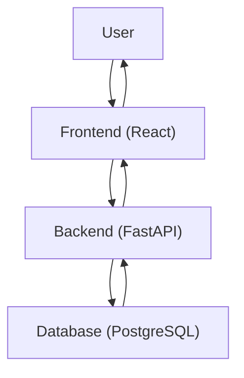
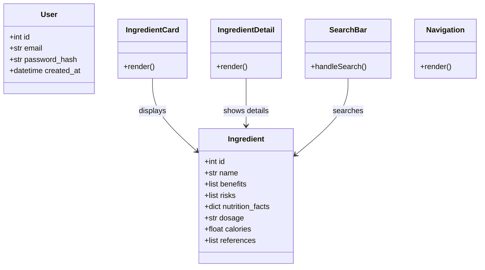

# **PHASE 3 — Software Design**

## 3.1 High-Level Design (HLD)

**Architecture Style:** Layered Architecture (Presentation, Application, Data)

This style separates concerns into distinct layers, promoting modularity and maintainability. For a web application, this fits well with frontend (presentation), backend (application), and database (data).

**Major Modules:**

- **Frontend Module:** React-based web interface handling user interactions, displaying ingredient lists, search functionality, and details pages.
- **Backend Module:** FastAPI-based REST API server managing business logic, authentication, and data processing.
- **Database Module:** PostgreSQL relational database storing ingredient data, user information, and research references.
- **Authentication Module:** AWS Cognito integration for optional user authentication.

**Data Flow:**

1. User accesses the website (no login required for browsing).
2. Frontend loads ingredient list via API call to Backend.
3. User searches: Frontend sends search query to Backend.
4. Backend queries Database using full-text search.
5. Database returns filtered results.
6. Backend processes and returns data to Frontend.
7. Frontend renders results and details.



---

## 3.2 Low-Level Design (LLD)

**Class Structures:**



**Explanation:** The class diagram illustrates the core classes in the system. The Ingredient and User classes are backend data models implemented in Python/FastAPI, representing the structured data stored in the database. The frontend components (IngredientCard, IngredientDetail, SearchBar, Navigation) are React components that handle user interface rendering and interactions. The arrows show relationships where frontend components depend on or display Ingredient data.

**Database Schema:**

```sql
CREATE TABLE users (
    id SERIAL PRIMARY KEY,
    email VARCHAR(255) UNIQUE NOT NULL,
    password_hash VARCHAR(255) NOT NULL,
    created_at TIMESTAMP DEFAULT CURRENT_TIMESTAMP
);

CREATE TABLE ingredients (
    id SERIAL PRIMARY KEY,
    name VARCHAR(255) NOT NULL,
    benefits TEXT[],
    risks TEXT[],
    nutrition_facts JSONB,
    dosage TEXT,
    calories FLOAT,
    references TEXT[]
);

-- Future: categories, user_ingredients for personalization
```

**API Endpoints:**

- GET /ingredients - Retrieve paginated ingredient list
- GET /ingredients/{id} - Get specific ingredient details
- POST /search - Search ingredients with query
- POST /auth/login - User login (optional)
- POST /auth/register - User registration (optional)

**Core Algorithms:**

- Search Algorithm: PostgreSQL full-text search using ts_vector and ts_query for efficient keyword matching on ingredient names and benefits.

**Pseudocode for Search Logic:**

```
function search_ingredients(query):
    if query is empty:
        return get_all_ingredients()
    
    // Use PostgreSQL full-text search
    search_vector = to_ts_vector('english', ingredient.name || ' ' || ingredient.benefits)
    search_query = to_ts_query('english', query)
    rank = ts_rank(search_vector, search_query)
    
    return ingredients
        .where(rank > 0)
        .order_by(rank DESC)
        .limit(50)
```

---
