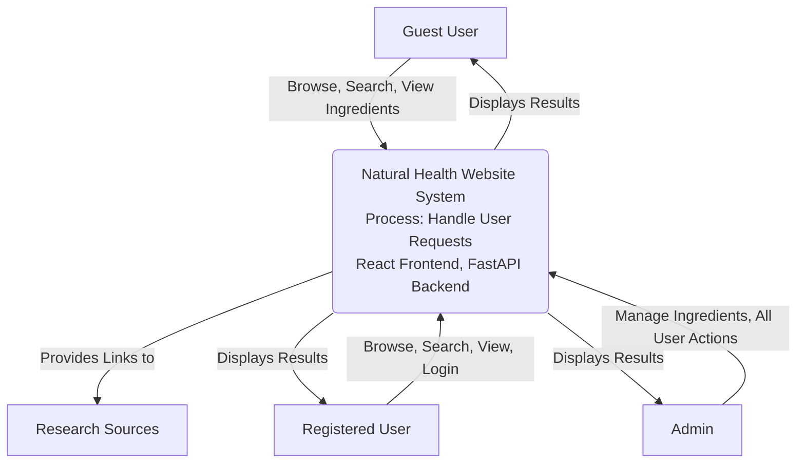
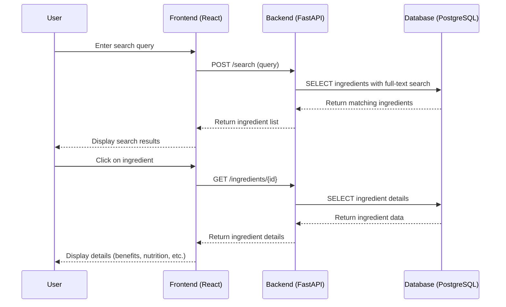
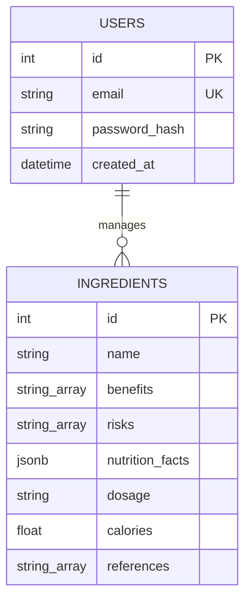
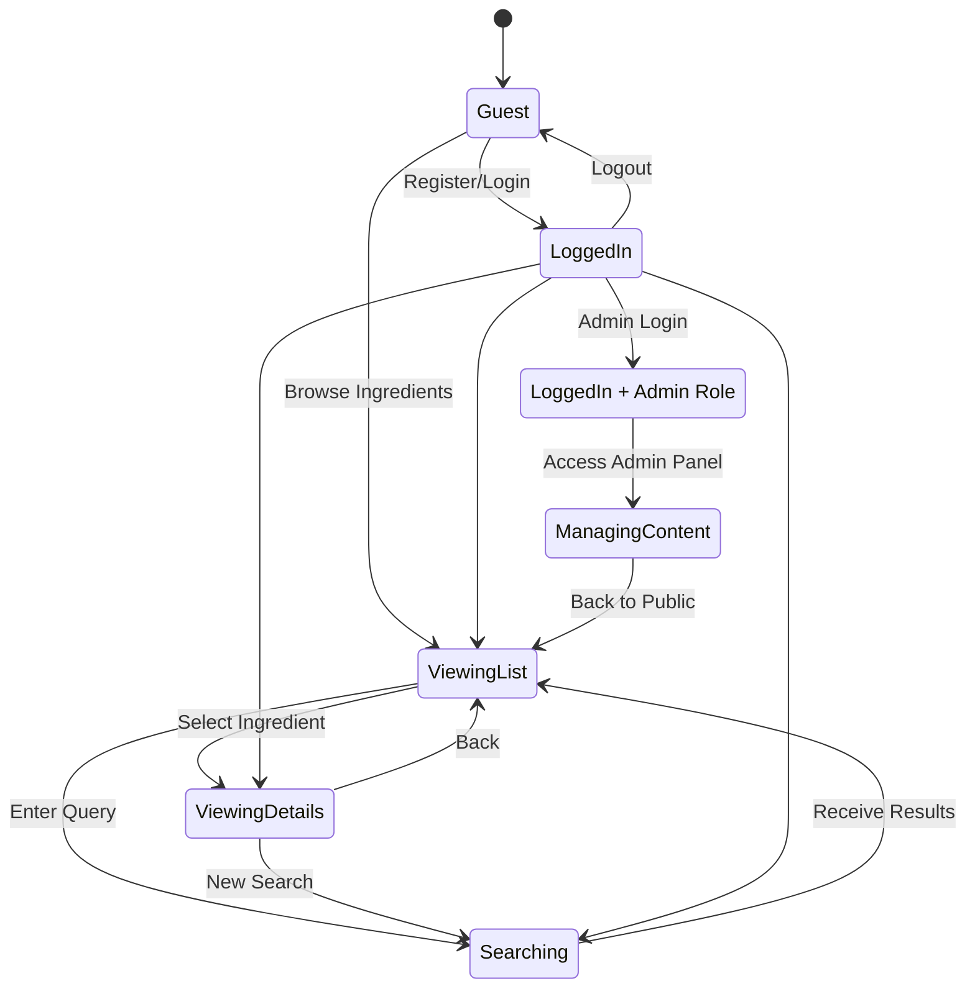

# **PHASE 4 — System Modeling (UML)**

## 4.1 Context Model

System Context Diagram

**Question:** Who interacts with what?

**Explanation:** The system context diagram shows the system boundary, external actors (users and external systems), and the interfaces or interactions between them. For Version 1 of the natural health website, the system is the web application, with guest and registered users interacting via the web interface, admins for content management, and external research sources accessed indirectly through links.

This diagram ensures consistency with Phase 1 (target users: primary health-conscious individuals, secondary recipe seekers, admins) and Phase 2 (functional requirements: guest access, optional authentication, view/search ingredients), focusing on the system's environment rather than internal use cases.

## 4.2 Interaction Model

Sequence Diagram

**Question:** What happens step-by-step?

**Explanation:** The interaction model illustrates the sequence of messages and operations between actors and system components during a key interaction. For Version 1, this focuses on the core user flow of searching for and viewing ingredient details, aligning with the layered architecture in Phase 3 (frontend, backend, database) and the data flow diagram there.

This sequence ensures consistency with Phase 2 (search returns results within 1-2 seconds, API endpoints) and Phase 3 (search algorithm using PostgreSQL full-text search).

## 4.3 Structural Model

Class Diagram / ER Diagram

**Question:** How is data structured?

**Explanation:** The structural model represents the static structure of the system, including data entities and their relationships. For Version 1, this includes an ER diagram for the relational database schema (PostgreSQL) and references the class diagram from Phase 3 for object-oriented design. The focus is on ingredient data storage and optional user management.

**ER Diagram:**

Note: For Version 1, users primarily manage ingredients (admin role), but individual user-ingredient relationships are planned for future versions. This aligns with Phase 3 database schema and Phase 2 data storage needs (ingredient data, user auth).

**Class Diagram Reference:** See Phase 3 for detailed class structures (Ingredient, User, frontend components). The system uses a relational model for data persistence and object-oriented design for application logic.

## 4.4 Behavioral Model

State Machine Diagram

**Question:** How does state change over time?

**Explanation:** The behavioral model shows how the system or its components change state over time in response to events. For Version 1, this focuses on the user session states, as authentication is optional and the core functionality is browsing. This ensures consistency with Phase 2 (guest access without forced login) and Phase 1 (user actions: search, view).

This diagram illustrates the state transitions for a typical user session, emphasizing that core features are accessible without login, aligning with the freemium model in Phase 1.

---

**Overall Consistency Check:** All diagrams in Phase 4 align with the Dann Framework's focus on clarity and the Version 1 scope (core web platform with ingredient data, no advanced features like AI or mobile). They reference and build upon Phases 1-3 without introducing contradictions, such as maintaining optional authentication and layered architecture.
