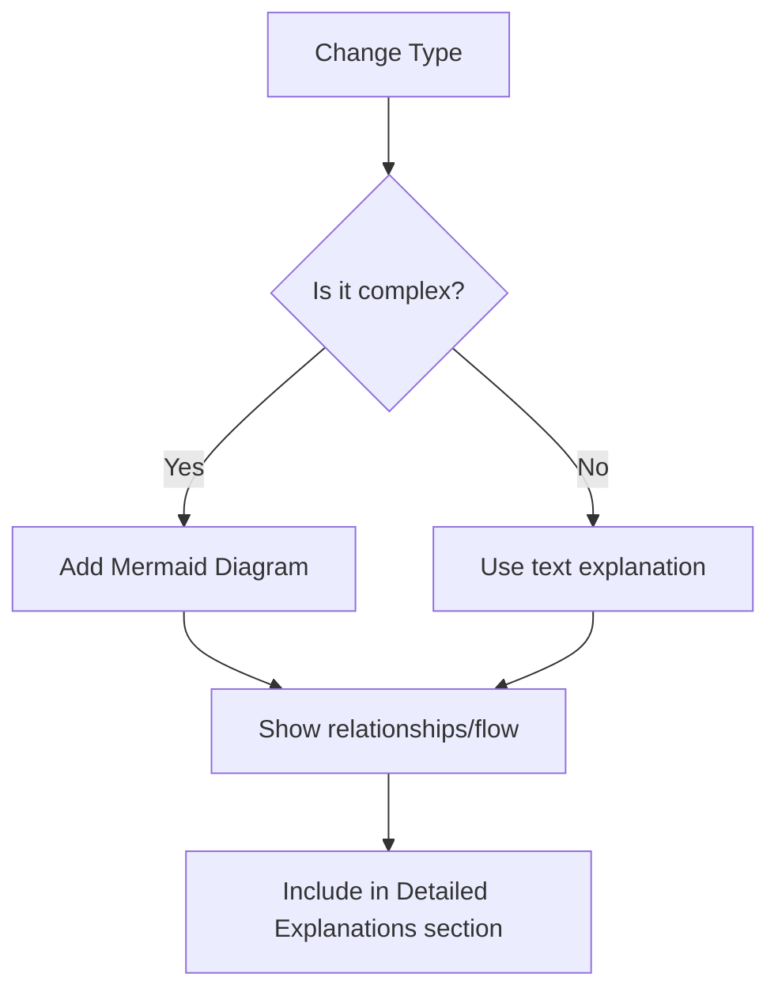

## Changelog Format

This directory includes a `Changelog/` folder for tracking detailed changes made during development. The changelog uses a structured format for easy navigation and understanding of modifications.

### Directory Structure
```
Changelog/
├── v1/                    # Version 1.x changes
│   ├── v_1_1_1.md        # Stage 1.1, Batch 1
│   ├── v_1_1_2.md        # Stage 1.1, Batch 2
│   └── ...
├── v2/                    # Version 2.x changes (future)
└── v3/                    # Version 3.x changes (future)
```

### File Naming Convention
- `v_{major}_{stage}_{batch}.md`
- `major`: Version number (e.g., 1 for V1)
- `stage`: Stage number (e.g., 1 for Stage 1)
- `batch`: Edit batch within that stage (e.g., 1 for first set of changes)

### Short Summary

### Changelog File Structure
Each changelog file follows this format:

#### Header
- **Title**: Version and stage description
- **Date**: Always add the current date

#### What We Did Section
- **Environment Setup**: Tools installed, environment configured
- **Documentation Updates**: Files modified with brief descriptions
- **Files Created/Modified**: Complete list with purposes

#### Detailed Explanations
- **Modified Files**: Specific changes made to each file
- **New Files**: Purpose and usage of created files
- **Technical Details**: Code changes, configurations, dependencies
- **Visual Diagrams**: Mermaid diagrams for complex changes (optional)

#### Usage Instructions
- **Setup Steps**: How to apply changes locally
- **Configuration**: Environment variables, settings
- **Testing**: How to verify changes work

#### Status/Next Steps
- **Current Status**: What's ready to use
- **Next Batch**: What comes next in development

### Visual Diagrams Feature
Changelog files can include Mermaid diagrams when they help clarify complex changes:



**When to use diagrams:**
- Complex file relationships or dependencies
- Multi-step processes or workflows
- Architecture changes or data flows
- Before/after state comparisons
- Integration points between components

**Diagram placement:** Add diagrams in the "Detailed Explanations" section with appropriate headers.

### Example Usage
- `v_1_1_1.md`: Initial development setup (Python venv, .env.example, .gitignore)
- `v_1_2_1.md`: AWS account configuration and IAM roles
- `v_1_3_1.md`: Backend API development changes

### Benefits
- **Developer Onboarding**: Quick understanding of project evolution
- **Change Tracking**: Detailed record of modifications and rationale
- **Debugging Aid**: Historical context for troubleshooting
- **Documentation Maintenance**: Structured approach to keeping docs current

## How did we Test if the Code works: 
 -[ ] Task 1....
