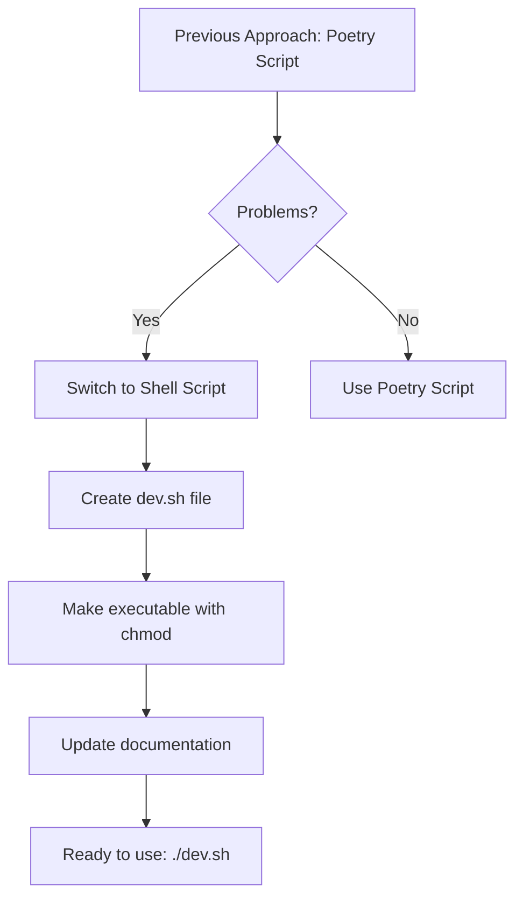

# Version 1.3.1.3: Create Shell Script for FastAPI Development Server

## Date
12/19/2025

## What We Did

### Environment Setup
- No new environment setup required - used existing development environment

### Documentation Updates
- Updated `Docs/Versions/Version 1.md` - Changed the approach from Poetry script to shell script and marked sub stage as completed (✅)

### Files Created/Modified
- Created `backend/dev.sh` - Shell script for starting FastAPI development server
- Modified `README.md` - Added development setup section with instructions for starting both backend and frontend servers

## Detailed Explanations

### Why Switch to Shell Script Approach
After multiple failed attempts to configure a Poetry script in `pyproject.toml` (which encountered `ModuleNotFoundError` issues), we decided to use a simpler shell script approach. This provides the same convenience with a shorter command (`./dev.sh`) and avoids Poetry's package management complexities for development server startup.



### Files Created

**backend/dev.sh**
This is a simple shell script that runs the Uvicorn command to start the FastAPI server. Think of it as a shortcut button that saves you from typing the long command every time.

- `#!/bin/bash` - Tells the system this is a bash script
- `uvicorn app.main:app --reload` - Starts the FastAPI app with hot reloading
- The `--reload` flag automatically restarts the server when you make code changes

**Modified Files**
**Docs/Versions/Version 1.md**
- Changed sub stage 3.1.1.3 from Poetry script approach to shell script approach
- Updated status from 🔶 to ✅ (completed)
- Simplified the description to focus on the working solution

**README.md**
- Added new "Development Setup" section
- Included step-by-step instructions for starting both backend and frontend
- Made it easy for beginners to get the development environment running

### Technical Details
The shell script approach is more straightforward for development because:
- It directly calls Uvicorn without going through Poetry's script management
- No need to worry about Poetry's package mode or installation issues
- Works immediately after making the file executable
- Can be easily customized or extended in the future

### Why This Matters for Beginners
Imagine you want to start your car. Instead of always turning the key and adjusting mirrors every time, you create a "quick start" button. That's what `dev.sh` does - it gives you a simple `./dev.sh` command that handles all the complex Uvicorn startup details for you.

## Usage Instructions

### Starting the Development Server
1. Open your terminal and navigate to the backend directory:
   ```
   cd backend
   ```

2. Run the development script:
   ```
   ./dev.sh
   ```

3. The FastAPI server will start on `http://localhost:8000`
4. You can visit `http://localhost:8000/docs` to see the API documentation

### Configuration
- No additional configuration needed
- The script uses the same environment variables as before
- Hot reloading is automatically enabled for development

### Testing the Setup
- After running `./dev.sh`, check that the server starts without errors
- Visit `http://localhost:8000/docs` in your browser to see the FastAPI interactive documentation
- Make a small change to any Python file in the backend and verify the server restarts automatically

## Current Status
- Shell script created and tested successfully
- Development server starts with a simple `./dev.sh` command
- Documentation updated in both Version 1.md and main README.md
- Hot reloading works for fast development iterations

## Next Steps
- Proceed to Stage 3.2: Implement Authentication APIs (AWS Cognito Integration)
- Set up AWS Cognito User Pool and App Client for user authentication
- Integrate authentication endpoints into the FastAPI application
