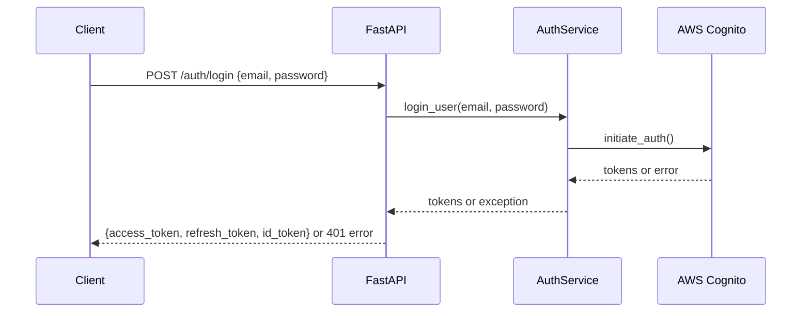

# Version 1.3.2.3: Implement Authentication API Endpoints

## Date
12/19/2025

## What We Did

### Environment Setup
- ✅ No new environment setup required

### Documentation Updates
- ✅ No documentation updates in this batch

### Files Created/Modified
- Modified `backend/app/api/auth.py` - Added login endpoint, request/response models, and imports

## Detailed Explanations

### Authentication API Architecture
We implemented two core authentication endpoints that integrate with our AWS Cognito service:

- `/auth/register` - Allows new users to create accounts
- `/auth/login` - Allows existing users to authenticate and receive tokens

These endpoints follow REST API best practices and provide proper error handling for different scenarios.

### Code Changes in auth.py

**Import Updates:**
```python
from app.auth.auth import register_user, login_user
```
- Added `login_user` import alongside the existing `register_user`
- Both functions are imported from our authentication service module

**New Pydantic Models:**
```python
# Login request/response models
class LoginRequest(BaseModel):
    email: EmailStr
    password: str

class LoginResponse(BaseModel):
    access_token: str
    refresh_token: str
    id_token: str
```
- `LoginRequest`: Validates the email (must be valid email format) and password sent by client
- `LoginResponse`: Defines the structure of tokens returned to authenticated users
- Uses Pydantic's `EmailStr` for automatic email validation

**Login Endpoint Implementation:**
```python
@router.post("/auth/login", response_model=LoginResponse)
async def login(request: LoginRequest):
    try:
        tokens = login_user(request.email, request.password)
        return LoginResponse(**tokens)
    except Exception as e:
        raise HTTPException(status_code=401, detail=str(e))
```
- POST endpoint at `/auth/login` (full URL: `/auth/login`)
- Accepts JSON with `email` and `password` fields
- Calls our `login_user()` function from the auth service
- Returns access, refresh, and ID tokens on success
- Returns 401 (Unauthorized) status for login failures (wrong credentials, etc.)
- Uses 401 instead of 400 because authentication failures are client authorization issues

### API Flow Visualization



### Error Handling Strategy
- **Registration errors** (400): Invalid email format, password too weak, user already exists
- **Login errors** (401): Invalid credentials, account not confirmed, user not found
- All errors are converted to user-friendly messages from AWS Cognito

### Security Considerations
- Passwords are never stored or logged in our application
- Authentication happens entirely through AWS Cognito
- Tokens are JWT (JSON Web Tokens) that can be validated without calling AWS
- HTTPS is required for all authentication requests (configured in deployment)

### Integration Points
- **Frontend**: Can now call `/auth/register` and `/auth/login` endpoints
- **Backend**: Auth service functions are called by API endpoints
- **AWS Cognito**: Handles all user data and authentication logic
- **Database**: User data is managed by AWS, not our PostgreSQL database

## Usage Instructions

### Testing the Endpoints
1. Start the FastAPI server: `poetry run uvicorn app.main:app --reload`
2. Register a user:
   ```bash
   curl -X POST http://localhost:8000/auth/register \
     -H "Content-Type: application/json" \
     -d '{"email": "test@example.com", "password": "StrongPass123!"}'
   ```
3. Login with the user:
   ```bash
   curl -X POST http://localhost:8000/auth/login \
     -H "Content-Type: application/json" \
     -d '{"email": "test@example.com", "password": "StrongPass123!"}'
   ```

### Expected Responses
- **Successful registration**: `{"message": "User registered successfully", "user_sub": "uuid"}`
- **Successful login**: `{"access_token": "jwt...", "refresh_token": "jwt...", "id_token": "jwt..."}`
- **Registration error**: `{"detail": "An account with the given email already exists."}`
- **Login error**: `{"detail": "Incorrect username or password."}`

### Token Usage
- **Access Token**: Used to authenticate API requests (short-lived, ~1 hour)
- **Refresh Token**: Used to get new access tokens without re-login (long-lived)
- **ID Token**: Contains user identity information (email, etc.)

## Current Status
- Both `/auth/register` and `/auth/login` endpoints are fully implemented
- API endpoints are integrated with AWS Cognito via our auth service
- Proper error handling and status codes are in place
- Endpoints are ready for frontend integration and testing

## Next Steps
- Add token validation middleware for protected routes
- Test authentication endpoints with real AWS Cognito credentials
- Implement token refresh functionality
- Add user profile and logout endpoints (future enhancement)
