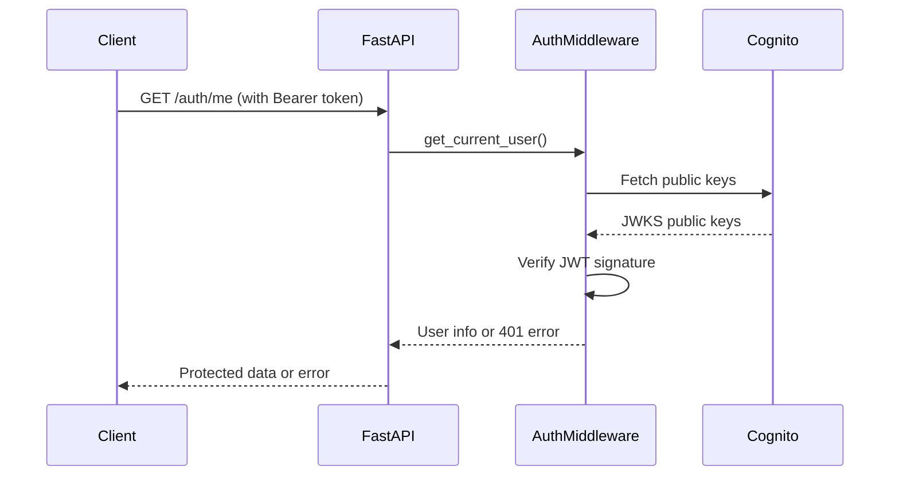

# Version 1.3.2.4: Implement Token Validation Middleware

## Date
12/19/2025

## What We Did

### Environment Setup
- ✅ Installed python-jose[cryptography] package for JWT token handling

### Documentation Updates
- ✅ No documentation updates in this batch

### Files Created/Modified
- Modified `backend/app/auth/auth.py` - Added JWT verification functions and security dependencies
- Modified `backend/app/api/auth.py` - Added protected route example with authentication dependency

## Detailed Explanations

### JWT Token Validation Architecture
We implemented middleware to validate AWS Cognito JWT tokens on protected API routes. This ensures that only authenticated users can access certain endpoints. The system uses industry-standard JWT (JSON Web Tokens) for secure, stateless authentication.

### What is JWT? (Beginner-Friendly Explanation)
JWT stands for **JSON Web Token**. Think of it like a **digital passport** or **secure ticket** that proves "you are who you say you are" without the system having to remember you.

**Imagine going to a concert:**
- You buy a ticket (like logging in)
- The ticket has your name, seat number, and is stamped by the venue (like a signature)
- You show the ticket to get in (like sending the token with your request)
- The ticket checker verifies the stamp is real (like validating the signature)

**In our app:**
- When you login, AWS Cognito gives you a JWT "ticket"
- The ticket contains your user information (email, ID, etc.)
- It's digitally signed so nobody can fake it
- Your app checks the signature to make sure it's valid
- No need to store login info on the server - the token proves you're authenticated

**Why JWT instead of sessions?**
- **Stateless**: Server doesn't need to remember who's logged in
- **Fast**: No database lookups to check if you're logged in
- **Secure**: Cryptographically signed, can't be tampered with
- **Standard**: Used by Google, Facebook, Amazon, etc.
- **Flexible**: Can contain custom user information

**JWT Structure (like a sandwich):**
```
Header.StuffInside.Signature
```

- **Header**: Says "I'm a JWT signed with RSA"
- **Stuff Inside**: Your user info (email, when it expires, etc.)
- **Signature**: Cryptographic proof it came from AWS Cognito

**The signature is the magic part** - it uses AWS's secret keys to create a unique "fingerprint" that proves the token is genuine.

### Python-Jose Installation
Added python-jose[cryptography] to handle JWT operations:
- **python-jose**: Library for encoding/decoding JWT tokens
- **cryptography**: Required for RSA signature verification
- Installed via Poetry: `poetry add "python-jose[cryptography]"`

### JWT Verification Process
JWT tokens from Cognito are digitally signed using RSA encryption. To verify a token:

1. **Extract Key ID**: Get the 'kid' (key identifier) from the JWT header
2. **Fetch Public Keys**: Download Cognito's public keys from `/.well-known/jwks.json`
3. **Find Matching Key**: Locate the correct public key using the 'kid'
4. **Verify Signature**: Use the public key to verify the token wasn't tampered with
5. **Validate Claims**: Check issuer, audience, and expiration time

### Code Changes in auth.py

**New Imports:**
```python
from jose import jwt, JWTError
from jose.exceptions import ExpiredSignatureError
import requests
from fastapi import Depends, HTTPException
from fastapi.security import HTTPBearer, HTTPAuthorizationCredentials
```
- `jose`: Core JWT library functions
- `requests`: For fetching Cognito's public keys
- `HTTPBearer`: FastAPI security scheme for Bearer token authentication

**Security Scheme:**
```python
security = HTTPBearer()
```
This creates a security dependency that extracts the Bearer token from the `Authorization` header.

**Token Verification Function:**
```python
def verify_token(token: str) -> dict:
```
This function takes a JWT token string and:
- Fetches Cognito's public keys via HTTPS
- Decodes the token header to find the key ID
- Verifies the token signature using the correct public key
- Validates standard claims (issuer, audience, expiration)
- Returns the decoded payload (user information)

**User Dependency:**
```python
def get_current_user(credentials: HTTPAuthorizationCredentials = Depends(security)) -> dict:
```
This FastAPI dependency:
- Automatically extracts the token from request headers
- Calls `verify_token()` to validate it
- Returns user information for use in route handlers
- Raises 401 errors for invalid/expired tokens

### Protected Route Implementation
Added `/auth/me` as an example of a protected endpoint:

```python
@router.get("/auth/me")
async def get_current_user_info(current_user: dict = Depends(get_current_user)):
```
- Uses `Depends(get_current_user)` to require authentication
- Returns user information from the validated JWT token
- Automatically returns 401 if token is missing/invalid

### Authentication Flow



### Security Benefits
- **Stateless**: No server-side session storage needed
- **Secure**: Cryptographically signed tokens prevent tampering
- **Fast**: Validation doesn't require AWS API calls (uses public keys)
- **Standard**: Uses OAuth 2.0 / OpenID Connect standards
- **Automatic**: FastAPI handles token extraction and error responses

### Error Handling
- **401 Unauthorized**: Invalid, expired, or missing tokens
- **400 Bad Request**: Malformed requests
- **Detailed Messages**: Clear error descriptions for debugging

### Usage in Other Routes
Any route can now require authentication by adding:

```python
from app.auth.auth import get_current_user

@router.get("/protected")
async def protected_route(current_user: dict = Depends(get_current_user)):
    return {"message": f"Hello {current_user['email']}!"}
```

### Performance Considerations
- Public keys are fetched on each request (could be cached in production)
- JWT verification is fast (cryptographic operations are optimized)
- No database lookups required for token validation

## Usage Instructions

### Testing Protected Routes
1. Register a user: `POST /auth/register`
2. Login to get tokens: `POST /auth/login`
3. Access protected route:
   ```bash
   curl -H "Authorization: Bearer YOUR_ACCESS_TOKEN" http://localhost:8000/auth/me
   ```

### Expected Responses
- **Valid token**: `{"email": "user@example.com", "sub": "uuid", "username": "user"}`
- **Invalid token**: `{"detail": "Invalid token: Signature verification failed"}`
- **Expired token**: `{"detail": "Token expired"}`
- **No token**: `{"detail": "Not authenticated"}`

### Token Types
- **Access Token**: Used for API authentication (short-lived)
- **ID Token**: Contains user identity information
- **Refresh Token**: Used to get new access tokens

## Current Status
- JWT token validation middleware fully implemented
- Protected routes can require authentication using dependencies
- Integration with AWS Cognito for secure token verification
- Example protected endpoint (`/auth/me`) ready for testing

## Next Steps
- Test authentication endpoints with real tokens
- Implement token refresh functionality
- Add user profile management endpoints
- Consider caching Cognito public keys for better performance
