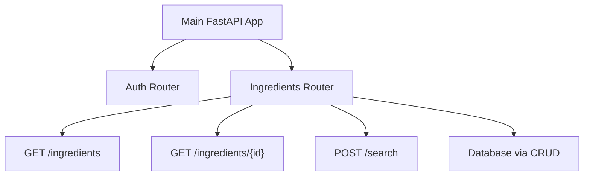

# Version 1.3.3.1: Set up Ingredients API Module and Implement GET Endpoints

## Date
12/19/2025

## What We Did

### Environment Setup
- No new environment setup required

### Documentation Updates
- No documentation updates in this batch

### Files Created/Modified
- Created `backend/app/api/ingredients.py` - New FastAPI router file for ingredient-related API endpoints with GET endpoints implemented
- Modified `backend/app/api/__init__.py` - Added import for the new ingredients router
- Modified `backend/app/main.py` - Integrated the ingredients router into the main FastAPI application
- Created `backend/app/crud/__init__.py` - Initialization file for the CRUD operations module
- Created `backend/app/crud/ingredients.py` - Database operations functions for ingredients (Create, Read, Update, Delete)

## Detailed Explanations

### API Module Architecture
We set up a new module for handling ingredient-related API endpoints. This follows FastAPI best practices by organizing endpoints into separate router files, making the codebase more maintainable and scalable.



### API Endpoints Implementation
We implemented two core endpoints for retrieving ingredient data from the database. These endpoints follow REST API conventions and provide paginated access to ingredient information.

```mermaid
graph TD
    A[Client Request] --> B{Endpoint}
    B -->|GET /ingredients| C[Paginated List]
    B -->|GET /ingredients/{id}| D[Single Ingredient]
    C --> E[Database Query]
    D --> E
    E --> F[Return Ingredient Data]
    F --> G[JSON Response]
```

### Files Created

**backend/app/api/ingredients.py**
This file creates a new FastAPI router specifically for ingredient operations. Think of a router like a traffic controller that directs web requests to the right handlers.

- `APIRouter`: Creates a mini-application for ingredient routes with `/ingredients` prefix
- `tags=["ingredients"]`: Groups these endpoints in API documentation
- Imports: Prepares for database access and CRUD operations
- `IngredientResponse` Model: A Pydantic class that defines the structure of ingredient data sent to clients. It includes all fields from the database (id, name, benefits, risks, nutrition_facts, dosage, calories, references). The `from_attributes = True` setting allows FastAPI to automatically convert database objects to this format.

**backend/app/crud/__init__.py**
This is like a welcome mat for the CRUD module, making its functions available to import.

**backend/app/crud/ingredients.py**
This file contains the database interaction functions. CRUD stands for Create, Read, Update, Delete - the basic operations for managing data.

- `get_ingredients()`: Fetches multiple ingredients with pagination (skip/limit)
- `get_ingredient_by_id()`: Gets a single ingredient by its ID number
- `search_ingredients()`: Advanced search using PostgreSQL's built-in text search capabilities

The search function uses full-text search to find ingredients by name or benefits. It converts text into searchable vectors and ranks results by relevance - like how Google ranks search results.

### Files Modified

**backend/app/api/__init__.py**
Added the import for `ingredients_router` so other parts of the app can access it.

**backend/app/main.py**
- Imported `ingredients_router` alongside the existing `auth_router`
- Added `app.include_router(ingredients_router)` to connect the ingredient endpoints to the main app

This makes the ingredient endpoints available at URLs like `/ingredients` and `/ingredients/1`.

## Usage Instructions

### Verifying the Setup
1. Start the FastAPI server: `cd backend && poetry run uvicorn app.main:app --reload`
2. Check the API documentation at `http://localhost:8000/docs` - you should see "ingredients" section with two endpoints
3. The server should start without import errors

### Testing the Endpoints
Visit `http://localhost:8000/docs` to see the new endpoints in the "ingredients" section.

#### Testing GET /ingredients
- **Basic request**: `GET http://localhost:8000/ingredients`
  - Returns first 50 ingredients (if any exist in database)
- **With pagination**: `GET http://localhost:8000/ingredients?skip=50&limit=25`
  - Skips first 50 ingredients, returns next 25

#### Testing GET /ingredients/{id}
- **Valid ID**: `GET http://localhost:8000/ingredients/1`
  - Returns ingredient with ID 1 (if it exists)
- **Invalid ID**: `GET http://localhost:8000/ingredients/999`
  - Returns 404 error: `{"detail": "Ingredient not found"}`

### Configuration
- Endpoints use the existing database connection
- Pagination defaults: skip=0, limit=50
- Limit maximum: 100 items per request
- No new environment variables needed

## Current Status
- Ingredients API module successfully set up with proper FastAPI router structure
- CRUD operations module created with database functions including full-text search
- Router integrated into main application
- GET /ingredients endpoint fully implemented with pagination
- GET /ingredients/{id} endpoint fully implemented with error handling
- Both endpoints integrated with existing CRUD functions
- Pydantic models ensure consistent data validation and documentation

## Next Steps
- Implement POST /search endpoint for ingredient search functionality
- Add any additional validation models if needed
- Test endpoints with real data in the database
