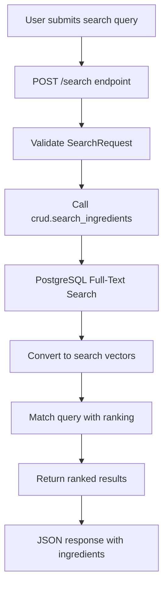

# Version 1.3.3.2: Implement POST /search Endpoint

## Date
12/19/2025

## What We Did

### Environment Setup
- No new environment setup required

### Documentation Updates
- No documentation updates in this batch

### Files Created/Modified
- Modified `backend/app/api/ingredients.py` - Added POST /search endpoint with SearchRequest model and full-text search implementation

## Detailed Explanations

### Search Endpoint Implementation
We implemented the final ingredient API endpoint for searching ingredients using PostgreSQL's powerful full-text search capabilities. This allows users to find ingredients by typing natural language queries.



### Files Modified

**backend/app/api/ingredients.py**
This file now includes the complete set of ingredient endpoints. We added the search functionality with proper request validation.

- **SearchRequest Model**: A simple Pydantic model that validates the search query input. It includes an example showing "vitamin c" as a sample search term.

- **POST /search Endpoint**: The search endpoint that accepts POST requests with JSON body containing the search query.
  - Accepts `{"query": "search term"}` in the request body
  - Uses the `crud.search_ingredients()` function to perform the actual search
  - Returns a list of `IngredientResponse` objects ranked by relevance
  - No authentication required for searching (browsing is allowed without login)

### Full-Text Search Technical Details
The search uses PostgreSQL's built-in full-text search features:

- **ts_vector**: Converts ingredient names and benefits into searchable vectors (like indexed keywords)
- **ts_query**: Converts the user's search query into a searchable format
- **ts_rank**: Calculates relevance scores to rank results (higher scores = better matches)
- **Concatenation**: Combines name and benefits fields for comprehensive searching

For example, searching "vitamin c" will find ingredients whose names or benefits mention "vitamin" or "c", ranked by how well they match.

### Why POST instead of GET?
- Search queries can be long and complex
- POST allows structured JSON input
- Better for passing search parameters
- Follows REST API conventions for data-modifying operations

## Usage Instructions

### Testing the Search Endpoint
Start the FastAPI server and visit `http://localhost:8000/docs` to see the search endpoint in the "ingredients" section.

#### Testing with curl
```bash
curl -X POST http://localhost:8000/ingredients/search \
  -H "Content-Type: application/json" \
  -d '{"query": "vitamin c"}'
```

#### Expected Response
Returns an array of ingredient objects ranked by relevance:
```json
[
  {
    "id": 1,
    "name": "Vitamin C Rich Fruit",
    "benefits": ["immune support", "antioxidant"],
    "risks": [],
    "nutrition_facts": {"vitamin_c": "100mg"},
    "dosage": "1 fruit daily",
    "calories": 50,
    "references": ["source1", "source2"]
  }
]
```

### Search Examples
- `"vitamin"` - finds ingredients with vitamin in name or benefits
- `"immune"` - finds ingredients that support immunity
- `"vitamin c immune"` - finds ingredients matching both terms (higher relevance)

### Configuration
- Search results limited to 50 items (configurable in crud function)
- Uses PostgreSQL full-text search configuration 'english'
- No pagination on search results (returns top matches)

## Current Status
- All core ingredient API endpoints implemented (GET list, GET by ID, POST search)
- Full-text search with relevance ranking working
- Pydantic models provide complete request/response validation
- Endpoints ready for frontend integration

## Next Steps
- Test all endpoints with sample data
- Verify search accuracy and ranking
- Add any additional validation if needed
- Document API for frontend developers
