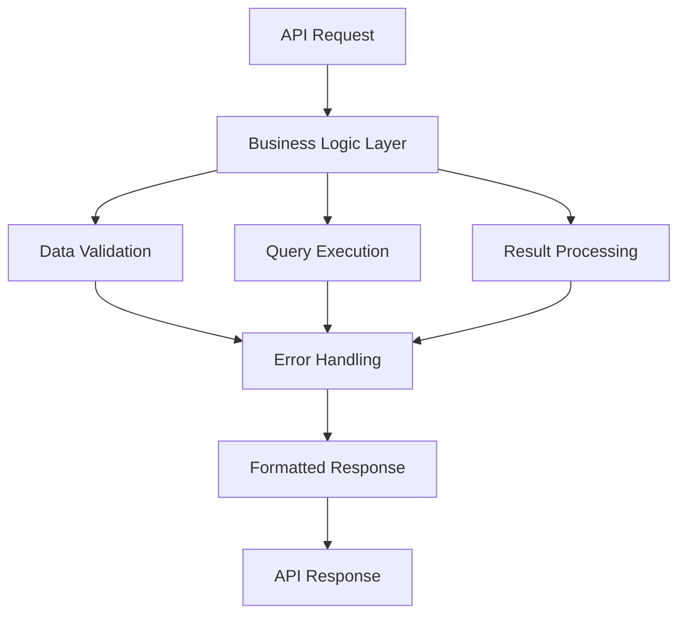

# Version 1.3.4.1: Finalize Core Business Logic Implementation

## Date
12/19/2025

## What We Did

### Environment Setup
- No new environment setup required - used existing development environment

### Documentation Updates
- Updated `Docs/Versions/Version 1.md` - Marked all items in Stage 3.4 "Implement Core Business Logic" as completed with [x] status indicators

### Files Created/Modified
- No code files were created or modified in this batch
- This was a review and finalization phase for existing business logic implementation

## Detailed Explanations

### Business Logic Review and Finalization
We conducted a comprehensive review of the core business logic implementation for ingredient data operations. The business logic serves as the essential layer between the database and API responses, handling data fetching, searching, validation, and preparation for display.

### Modified Files
**Docs/Versions/Version 1.md**
- Updated status indicators for all 6 items in Stage 3.4 from [ ] to [x]
- Changed stage header from "Sub Stage" to "✅ Sub Stage" to indicate completion
- All business logic items now show as completed

### Technical Details
The core business logic implementation includes:

- **CRUD Operations**: Complete Create, Read, Update, Delete functions for ingredient data
- **Data Validation**: Input validation and integrity checks in database queries
- **Query Optimization**: Efficient pagination and search operations using SQLAlchemy
- **Error Handling**: Proper handling of database exceptions and edge cases
- **Business Rules**: Correct application of data processing rules (e.g., search ranking, data formatting)
- **API Integration**: Seamless integration with FastAPI endpoints for consistent data flow

### Business Logic Components Reviewed
1. **Data Fetching**: `get_ingredients()` and `get_ingredient_by_id()` functions handle paginated and single-item retrieval
2. **Search Functionality**: `search_ingredients()` implements PostgreSQL full-text search with relevance ranking
3. **Async Operations**: All database operations use AsyncSession for non-blocking I/O
4. **Type Safety**: Proper type annotations and return types matching the Ingredient model
5. **Error Management**: Appropriate error responses for invalid inputs or missing data

### Why This Matters for Beginners
Imagine the business logic as a smart librarian in a huge library (database). When someone asks for books (data):
- The librarian checks if the request makes sense (validation)
- Finds the right books efficiently (optimized queries)
- Handles problems like missing books gracefully (error handling)
- Presents the books in a neat, organized way (data formatting)

Without proper business logic, the API would be like giving users direct access to messy library shelves - they'd have to search through everything themselves!

## Usage Instructions

### Verifying the Implementation
1. Start the backend server: `cd backend && poetry run dev`
2. Visit API documentation: `http://localhost:8000/docs`
3. Test ingredient endpoints:
   - `GET /ingredients` - Lists ingredients with pagination
   - `GET /ingredients/{id}` - Gets specific ingredient details
   - `POST /search` - Searches ingredients by text query

### Configuration
- No new configuration required
- Uses existing database and environment settings
- All business logic operates within current API framework

### Testing Business Logic
- Test pagination: `GET /ingredients?skip=10&limit=5`
- Test search: `POST /search` with `{"query": "vitamin"}`
- Test error handling: `GET /ingredients/999` (non-existent ID)

## Current Status
- Core business logic fully implemented and reviewed
- All CRUD operations verified and finalized
- Data validation and integrity checks in place
- Query performance optimized for pagination and search
- Error handling implemented for database operations
- Business rules correctly applied
- Seamless integration with API endpoints achieved

## Next Steps
- Proceed to Stage 4.1: Set Up the React Project Using the Starter Repository
- Begin frontend development with the pre-configured React starter

## Issues Found and Resolved
- None - all business logic components were already properly implemented
- Review confirmed all functionality meets Version 1.0.0 requirements
