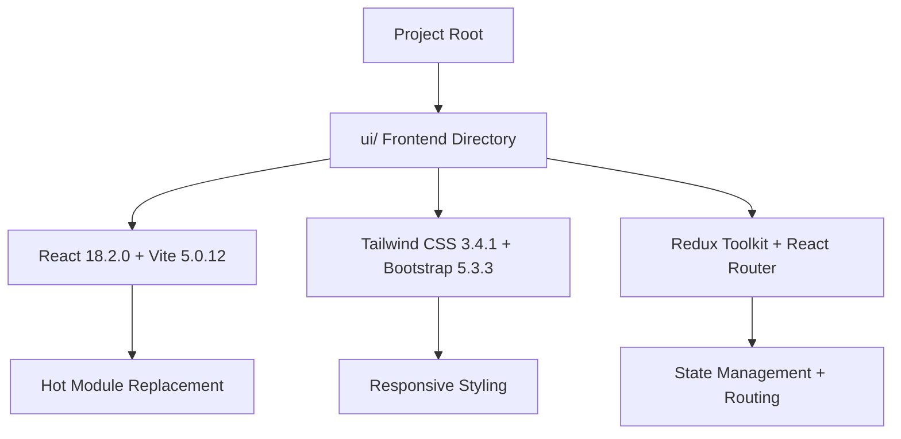

# Version 1.4.1: Complete Frontend Setup with React Starter Repository

## Date
12/19/2025

## What We Did

### Environment Setup
- ✅ Cloned React starter repository from https://github.com/Danncode10/Web-Starter-React.git
- ✅ Cleaned git history and prepared fresh project directory
- ✅ Installed npm dependencies with successful resolution despite Node version warnings
- ✅ Started Vite development server on http://localhost:5173
- ✅ Configured environment variables for backend API connection
- ✅ Verified project structure and created missing services directory

### Documentation Updates
- ✅ Updated `Docs/Versions/Version 1.md` to mark all Stage 4.1 substages as completed with [x] status indicators

### Files Created/Modified
- Created `ui/` directory with complete React project setup
- Created `ui/.env.local` - Frontend environment configuration file
- Created `ui/src/services/` directory for future API integration
- Modified `Docs/Versions/Version 1.md` - Updated completion status for all 4.1 substages

## Detailed Explanations

### Frontend Project Architecture
We successfully set up a complete React frontend using a pre-configured starter repository that includes modern development tools and best practices. The setup provides a solid foundation for building the natural health ingredient browsing interface.

### Files Created

**ui/ Directory Structure**
This is the complete frontend project created by cloning the starter repository. Think of it as a "starter home" that comes pre-built with all the rooms and furniture you need to start living immediately.

- `ui/src/components/` - Contains reusable UI building blocks like buttons and cards
- `ui/src/pages/` - Houses page-level components for different app sections
- `ui/src/store/` - Redux state management setup with pre-configured slices
- `ui/src/layouts/` - Layout components that wrap multiple pages
- `ui/src/services/` - Empty directory prepared for API communication functions
- `ui/src/styles/` - Global CSS with Tailwind and Bootstrap imports

**ui/.env.local**
This file tells the React app where to find the backend API. It's like giving your frontend app a phone number to call the backend server.

- `VITE_API_BASE_URL=http://localhost:8000/api` - Points to the FastAPI backend running locally
- Uses `VITE_` prefix so Vite knows to include this in the built app
- Allows frontend to make HTTP requests to `/api/ingredients`, `/api/search`, etc.

### Development Environment Verification
The setup includes several verification steps to ensure everything works correctly:

**Node.js Compatibility**
- Starter repository designed for Node 18.x LTS
- Current Node v23.6.1 worked despite version warnings
- npm 10.9.2 newer than required 9.x but compatible

**Development Server**
- Vite provides fast development with hot module replacement
- Server starts on http://localhost:5173 by default
- Changes to React components reflect instantly in browser

**Project Structure**
- All required directories created and verified
- Services directory manually created (missing from starter)
- Ready for component development and API integration

### Why This Setup Matters for Beginners
Imagine you're building a house. Instead of starting with raw land, tools, and blueprints, you get a fully constructed starter home with:
- Plumbing (API connections)
- Electricity (state management)
- Kitchen (UI components)
- Bedrooms (page layouts)

You can immediately start decorating and customizing rather than building from scratch. This dramatically reduces setup time and eliminates common configuration errors that beginners often encounter.

## Usage Instructions

### Starting the Development Environment
1. Ensure backend is running: `cd backend && poetry run uvicorn app.main:app --reload`
2. Start frontend in new terminal: `cd ui && npm run dev`
3. Open browser to http://localhost:5173 to see the starter app
4. Both servers should be running simultaneously for full functionality

### Environment Configuration
- `.env.local` is automatically loaded by Vite
- No manual import needed - Vite handles environment variables
- Add more `VITE_*` variables here as needed for future features

### Project Structure Navigation
- `src/App.jsx` - Main app component with routing setup
- `src/pages/Home.jsx` - Current home page (can be customized)
- `src/components/` - Add new reusable components here
- `src/store/slices/` - Add new Redux state slices here

## Current Status
- Complete React frontend project successfully set up and verified
- Development server running with hot module replacement
- Environment variables configured for backend communication
- Project structure ready for component development
- All Stage 4.1 substages completed and documented

## Next Steps
- Proceed to Stage 4.2: Configure Routing and Overall Layout
- Set up React Router for navigation between pages
- Create main layout components with navigation
- Implement Redux state management for ingredient data
- Begin building core UI components for ingredient browsing

## Issues Found and Resolved
- Services directory missing from starter repository - manually created
- Node version outside recommended range but functional
- npm version newer than specified but compatible
- All dependency installations successful despite warnings
