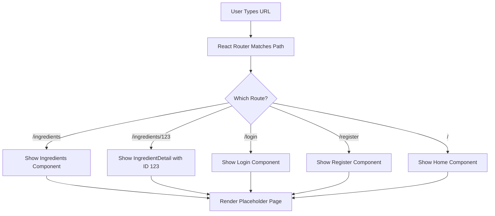

# Version 1.4.2.2: Set Up Main Router Structure

## Date
12/19/2025

## What We Did

### Environment Setup
- No new environment setup required - used existing React development environment

### Documentation Updates
- Updated `Docs/Versions/Version 1.md` - Marked sub-stage 4.2.2 checkboxes as completed ([x])

### Files Created/Modified
- Created `ui/src/pages/Ingredients.jsx` - Placeholder component for ingredients list page
- Created `ui/src/pages/IngredientDetail.jsx` - Placeholder component for individual ingredient details
- Created `ui/src/pages/Login.jsx` - Placeholder component for login page
- Created `ui/src/pages/Register.jsx` - Placeholder component for registration page
- Modified `ui/src/App.jsx` - Added route configurations and component imports

## Detailed Explanations

### What is Client-Side Routing?
Imagine your website as a house with multiple rooms. Traditionally, going from one room to another requires the entire house to be rebuilt (page refresh). Client-side routing allows you to move between "rooms" instantly without rebuilding the house - React Router handles this by showing/hiding different components based on the URL.

### Route Structure Created
The application now supports navigation to these key pages:
- `/` - Home/Dashboard (already existed)
- `/ingredients` - Browse all natural ingredients
- `/ingredients/:id` - View details for a specific ingredient (e.g., /ingredients/123)
- `/login` - User authentication page
- `/register` - New user registration page

### Files Created

**ui/src/pages/Ingredients.jsx**
- Simple React component that displays a placeholder message
- Will be replaced with full ingredient browsing functionality later
- Returns JSX with heading and "coming soon" message

**ui/src/pages/IngredientDetail.jsx**
- Uses `useParams()` hook from React Router to capture the ingredient ID from URL
- Displays the ID in the placeholder message
- Foundation for showing detailed ingredient information

**ui/src/pages/Login.jsx & ui/src/pages/Register.jsx**
- Basic placeholder components for authentication pages
- Will be enhanced with forms and validation in future stages

**Modified ui/src/App.jsx**
- Added imports for all new page components
- Extended the Routes configuration with new Route elements
- Each route maps a URL path to a specific React component
- Dynamic routing implemented for ingredient details using `:id` parameter

### Technical Details
- **Dynamic Routing**: `/ingredients/:id` uses a colon (`:`) to indicate a URL parameter
- **useParams Hook**: Allows components to access URL parameters (like the ingredient ID)
- **Route Matching**: React Router matches URLs from top to bottom, so more specific routes (with parameters) come after general ones
- **Component Mapping**: Each `<Route>` element connects a URL path to a component that renders when that path is visited

### Why Placeholder Components?
These simple components serve as "construction signs" on the website. They show that the routing works correctly and provide a foundation for building the full features later. Think of them as empty rooms in a house - the doors open and close properly, but the furniture and decorations come later.

### Beginner Analogy
Setting up routing is like installing doors in your house:
- Each door (route) leads to a room (component)
- The doorknob (URL parameter) can be turned to different positions (IDs)
- The hallway (App.jsx) directs visitors to the right doors
- For now, each room has just a sign saying "Under Construction" (placeholder components)

## Usage Instructions

### Testing the Routing
1. Start the development server: `cd ui && npm run dev`
2. Visit `http://localhost:5173` in your browser
3. Test navigation by manually typing URLs:
   - `http://localhost:5173/ingredients` - Should show "Ingredients" heading
   - `http://localhost:5173/ingredients/42` - Should show "Ingredient Detail" with ID 42
   - `http://localhost:5173/login` - Should show "Login" heading
   - `http://localhost:5173/register` - Should show "Register" heading

### Configuration
- All routes are configured in `App.jsx` within the `<Routes>` component
- No additional configuration needed at this stage
- Routes are wrapped in `MainLayout` for consistent page structure

### Development Notes
- Placeholder components use simple `
` and `<h1>` elements for basic display
- The `useParams` hook in `IngredientDetail.jsx` demonstrates dynamic routing
- All components follow React functional component pattern with default exports

## Current Status
- Router structure fully configured with all required routes
- Placeholder page components created for future development
- Dynamic routing implemented for ingredient details
- Documentation updated to reflect completion
- Ready for navigation bar and layout implementation

## Next Steps
- Proceed to Sub-stage 4.2.3: Create Root App Component with Providers
- Add Redux Provider for state management
- Integrate global CSS imports for Tailwind and Bootstrap
- Ensure all providers wrap the application correctly
