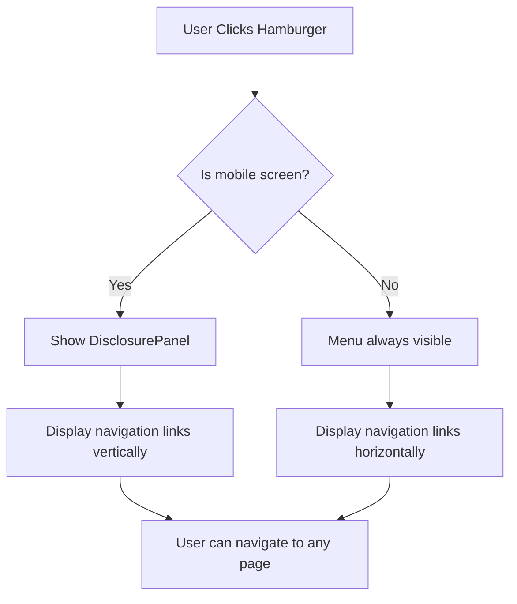

# Version 1.4.2.3: Implement Main Layout Component with Headless UI Navigation

## Date
12/19/2025

## What We Did

### Environment Setup
- Installed Headless UI React library (`@headlessui/react`) for accessible UI components
- Installed Heroicons library (`@heroicons/react`) for consistent iconography
- Removed Bootstrap CSS and JS imports to eliminate CSS conflicts with Tailwind

### Documentation Updates
- Updated `Docs/Versions/Version 1.md` - Marked sub-stage 4.2.4 checkboxes as completed ([x])

### Files Created/Modified
- Modified `ui/package.json` - Added `@headlessui/react` and `@heroicons/react` dependencies
- Modified `ui/package-lock.json` - Updated lock file with new dependency versions
- Modified `ui/src/main.jsx` - Removed Bootstrap CSS and JS imports for clean Tailwind-only setup
- Modified `ui/src/styles/index.css` - Cleaned up Bootstrap-specific CSS overrides, reverted to pure Tailwind
- Modified `ui/src/layouts/MainLayout.jsx` - Implemented responsive navigation using Headless UI Disclosure component

## Detailed Explanations

### Why Switch to Headless UI?
Imagine you're building a website and want a navigation menu that works perfectly on both phones and computers. Bootstrap had conflicts with our Tailwind CSS setup (like two chefs trying to use the same kitchen tools differently). Headless UI is like a professional toolkit that gives us clean, accessible components without styling conflicts - we just add our own Tailwind classes to make it look beautiful.

### Files Modified

**ui/package.json & ui/package-lock.json**
- Added `"@headlessui/react": "^2.1.3"` for UI components
- Added `"@heroicons/react": "^2.1.4"` for menu icons
- These are modern React libraries that work seamlessly with Tailwind CSS

**ui/src/main.jsx**
- Removed `import 'bootstrap/dist/css/bootstrap.min.css'` - No longer needed
- Removed `import 'bootstrap/dist/js/bootstrap.bundle.min.js'` - Eliminated to avoid conflicts
- Kept only Tailwind CSS import for consistent styling

**ui/src/styles/index.css**
- Removed all Bootstrap-specific CSS overrides
- Back to clean Tailwind base, components, utilities setup

**ui/src/layouts/MainLayout.jsx**
- **Navigation Array**: Created array of navigation items (Home, Ingredients, Login, Register) with their routes
- **Disclosure Component**: Uses Headless UI's Disclosure for mobile menu toggle - it's like a smart door that opens/closes
- **Responsive Design**: Hidden menu on mobile (sm:hidden), shown as hamburger menu
- **Icons**: Bars3Icon for hamburger, XMarkIcon for close button
- **React Router Integration**: All links use React Router's Link component for SPA navigation
- **Accessibility**: Includes sr-only labels and proper ARIA attributes for screen readers

### How the Navigation Works
Think of the navigation like a restaurant menu:
- **Desktop**: All menu items are always visible in a neat row
- **Mobile**: Menu items are hidden behind a hamburger icon (three lines)
- **Toggle**: Click the hamburger to "open the menu" and see all items
- **Close**: Click the X or outside to close the menu

### Layout Structure
The layout uses a full-height container with:
- **Navigation Bar**: Fixed at top with brand and menu
- **Main Content**: Flexible middle area that grows to fill space
- **Footer**: Sticks to bottom with copyright notice

### Technical Details
- **Disclosure Component**: Manages open/closed state without custom JavaScript
- **group-data-[open]:hidden**: Tailwind's group modifier hides/shows icons based on state
- **focus:ring-2**: Accessibility focus indicators for keyboard navigation
- **max-w-7xl**: Consistent max-width container from the example
- **bg-white shadow-sm**: Clean light theme navigation bar

### Why This Approach Works Better
1. **No CSS Conflicts**: Pure Tailwind means no fighting between frameworks
2. **Accessibility First**: Headless UI built with a11y in mind
3. **Lightweight**: Only loads what we need, no heavy Bootstrap JS
4. **Modern React**: Uses hooks and modern patterns
5. **Easy to Customize**: All styling done with Tailwind classes

## Usage Instructions

### Testing the Navigation
1. Start the development server: `cd ui && npm run dev`
2. Visit `http://localhost:5174` in your browser
3. **Desktop Test**:
   - Resize window to wide screen
   - See all navigation links: Home, Ingredients, Login, Register
   - Click any link to navigate (React Router handles the routing)
4. **Mobile Test**:
   - Resize window to narrow (mobile size)
   - See hamburger menu icon (three lines) on left
   - Click hamburger to open menu
   - See vertical list of navigation links
   - Click X or outside to close menu
   - Click any link to navigate

### Configuration
- Navigation items defined in `navigation` array in MainLayout.jsx
- Change `current: true` to highlight active page (currently set to Home)
- Colors use Tailwind indigo theme - modify classes for different branding
- Brand text "Natural Health" links to home page

### Development Notes
- Uses Tailwind responsive prefixes: `sm:` for small screens and up
- Disclosure component automatically manages focus and keyboard navigation
- All icons from Heroicons are SVG-based and scale perfectly
- Layout uses flexbox for proper full-height behavior

## Current Status
- Responsive navigation fully implemented and tested
- Headless UI provides excellent accessibility support
- Clean integration with React Router for SPA navigation
- No CSS conflicts with Tailwind framework
- Mobile hamburger menu working correctly
- Ready for next development stage

## Next Steps
- Proceed to Sub-stage 4.2.5: Add Route Protection and Redirects
- Implement optional authentication logic
- Ensure browsing routes remain accessible without login
