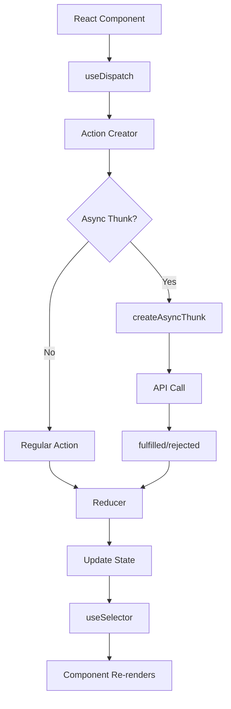

# Version 1.4.3 - Redux State Management Implementation

**Date**: December 22, 2025

## What We Did

### Documentation Updates
- Updated `Docs/Versions/Version 1.md` to mark sub-stage 4.3 checklist items as completed
- Updated `ui/README.md` to reflect new Redux store structure and remove outdated references

### Files Created/Modified
- **Created**: `ui/src/store/slices/ingredientsSlice.js` - Manages ingredient data and API calls
- **Created**: `ui/src/store/slices/authSlice.js` - Handles user authentication state
- **Created**: `ui/src/store/slices/filtersSlice.js` - Manages search filters and parameters
- **Created**: `ui/src/store/slices/paginationSlice.js` - Controls pagination state
- **Modified**: `ui/src/store/index.js` - Configured Redux store with new slices
- **Modified**: `ui/src/pages/Home.jsx` - Removed example counter component and updated content
- **Removed**: `ui/src/store/slices/counterSlice.js` - Example slice no longer needed
- **Removed**: `ui/src/components/ReduxCounter.jsx` - Example component cleaned up

## Detailed Explanations

### What is Redux State Management?
Imagine your React app as a big shopping mall. Each store (component) needs to know about customers, inventory, and sales. Without organization, it would be chaos! Redux acts like a central mall management office that keeps track of everything in one place.

**Key Concepts for Beginners:**
- **State**: The current "situation" of your app (like current user, loaded data, loading status)
- **Actions**: Messages telling the app "something happened" (like "user clicked login", "data loaded")
- **Reducers**: Functions that update the state based on actions (like "add item to cart")
- **Store**: The central place where all state lives
- **Slices**: Organized sections of the store (like "auth" section, "ingredients" section)

### New Files Created

#### ingredientsSlice.js
This file manages everything related to ingredient data. Think of it as the "ingredient department" of our app.

**Features:**
- Fetches ingredient lists from the API
- Handles searching for ingredients
- Stores selected ingredient details
- Tracks loading and error states
- Uses async thunks for API calls (functions that can wait for server responses)

**Beginner Explanation:**
When you want to show a list of ingredients, this slice:
1. Tells the app "I'm loading data"
2. Calls the backend API
3. Stores the received ingredients
4. Updates loading status
5. Handles any errors that occur

#### authSlice.js
Manages user login and authentication. Like a security checkpoint for the app.

**Features:**
- Login and registration with AWS Cognito
- Stores authentication tokens
- Tracks if user is logged in
- Handles token verification
- Manages logout functionality

**Beginner Explanation:**
When a user logs in:
1. Sends login request to server
2. Receives authentication token
3. Saves token in browser storage
4. Updates app state to "logged in"
5. Redirects user to protected areas

#### filtersSlice.js
Handles search and filter settings. Like the search bar and filter options.

**Features:**
- Stores current search query
- Manages filter categories
- Handles sort options
- Supports additional custom filters

**Beginner Explanation:**
When you type in the search box:
1. Updates the search query in state
2. Other components can read this query
3. Triggers API calls with the search term
4. Results get filtered based on these settings

#### paginationSlice.js
Controls page navigation for large lists. Like the "next page" buttons.

**Features:**
- Tracks current page number
- Manages items per page
- Calculates total pages
- Provides next/previous navigation

**Beginner Explanation:**
For a list of 100 ingredients showing 10 per page:
1. Current page = 1 (shows items 1-10)
2. Next page = 2 (shows items 11-20)
3. Automatically calculates total pages (10 pages)

### Modified Files

#### store/index.js
Updated the main Redux store configuration to include all new slices.

**Changes:**
- Imported all new slice reducers
- Added them to the store configuration
- Removed the old counter slice

**Before:**
```javascript
import counterReducer from './slices/counterSlice'
export const store = configureStore({
  reducer: { counter: counterReducer }
})
```

**After:**
```javascript
import ingredientsReducer from './slices/ingredientsSlice'
import authReducer from './slices/authSlice'
// ... other imports
export const store = configureStore({
  reducer: {
    ingredients: ingredientsReducer,
    auth: authReducer,
    // ... other reducers
  }
})
```

#### Home.jsx
Cleaned up the home page by removing example components and updating content.

**Changes:**
- Removed import and usage of ReduxCounter
- Updated welcome message for NutriFriendly
- Changed button text to be more relevant

### Technical Implementation Details

#### Async Thunks
We used `createAsyncThunk` from Redux Toolkit for API calls. This allows:
- Automatic loading states
- Error handling
- Async operations in Redux

**Example from ingredientsSlice:**
```javascript
export const fetchIngredients = createAsyncThunk(
  'ingredients/fetchIngredients',
  async (params, { rejectWithValue }) => {
    try {
      const response = await ingredientsApi.getIngredients(params);
      return response.data;
    } catch (error) {
      return rejectWithValue(error.message);
    }
  }
);
```

#### Slice Structure
Each slice follows the same pattern:
- `initialState`: Starting values
- `reducers`: Synchronous actions
- `extraReducers`: Handle async thunk results

#### State Flow
```
Component → dispatch(action) → thunk → API call → update state → component re-renders
```

### Visual Diagrams



## Usage Instructions

### Setup Steps
1. The Redux store is already configured in `src/store/index.js`
2. Import the store in `src/main.jsx` (already done)
3. Wrap your app with Redux Provider (already done in App.jsx)

### Configuration
No additional configuration needed. The store is ready to use.

### Testing
To test the Redux setup:
1. Open browser dev tools
2. Install Redux DevTools extension
3. Navigate to the app
4. Check that no console errors appear
5. Verify store state in DevTools

## Status/Next Steps

### Current Status
✅ Redux State Management fully implemented
✅ Store configured with all necessary slices
✅ Async operations ready for API integration
✅ Example code cleaned up
✅ Documentation updated

### Next Batch
The next development stage is **4.4: Develop Core UI Components**, which will create the actual React components that connect to this Redux state using `useDispatch` and `useSelector` hooks.
