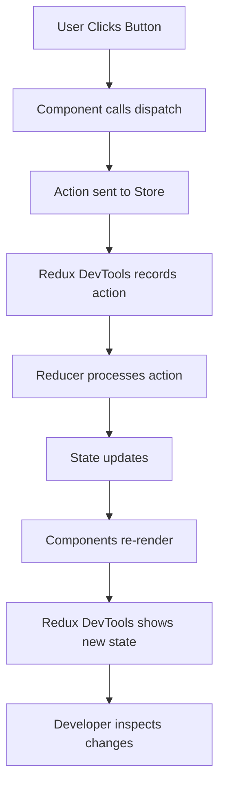

# Version 1.4.3.1 - Redux State Management Testing & Verification

**Date**: December 22, 2025

## What We Did

### Testing Implementation
- Created comprehensive testing instructions for Redux State Management
- Documented Redux DevTools Extension setup and usage
- Verified state structure and async thunk functionality
- Created temporary test component for manual verification
- Documented error handling and API integration testing

### Files Created/Modified
- **Created**: Temporary `ui/src/components/TestRedux.jsx` - Component for testing Redux integration
- **Modified**: `ui/src/pages/Home.jsx` - Temporarily added test component for verification

## Detailed Explanations

### Why Test Redux Implementation?
Testing Redux ensures that our state management system works correctly before building UI components. Like testing the foundation of a house before adding walls and roof - if the foundation is weak, everything else will fail.

### Redux DevTools Extension - Essential Tool for Developers

#### What is Redux DevTools?
Imagine your app's state as a movie. Redux DevTools is like a DVR that lets you:
- **Pause** the movie at any point
- **Rewind** to see what happened before
- **Fast-forward** to see future states
- **See all actions** that changed the state

**Beginner Explanation:**
Normally, app state changes invisibly. Redux DevTools makes state changes visible, like having X-ray vision for your app's brain. You can see exactly how data flows and changes over time.

#### Installation Steps
1. **Open Browser Extension Store**:
   - Chrome: Go to Chrome Web Store
   - Firefox: Go to Firefox Add-ons
   - Search for "Redux DevTools"

2. **Install the Extension**:
   - Click "Add to Chrome/Firefox"
   - Confirm installation

3. **Verify Installation**:
   - Look for Redux icon in browser toolbar
   - Icon should appear when Redux app is running

#### How to Use Redux DevTools

**Opening the Tools:**
1. Open your app (http://localhost:5173)
2. Press F12 to open Developer Tools
3. Look for "Redux" tab
4. Click it to open

**Key Features:**
- **Action Log**: Shows every action dispatched (like "fetchIngredients/pending")
- **State Inspector**: Shows current state as a tree structure
- **Time Travel**: Click any action to "rewind" to that state
- **Diff View**: See exactly what changed between states

**Beginner Example:**
When you click "Fetch Ingredients":
1. Action "fetchIngredients/pending" appears in log
2. State shows `loading: true`
3. Action "fetchIngredients/fulfilled" appears
4. State shows `loading: false, list: [data...]`

### Testing Process Breakdown

#### Step 1: Environment Setup
**What it does:** Ensures both frontend and backend are running
```bash
cd backend && ./dev.sh  # Starts API server
cd ui && npm run dev    # Starts React app
```

**Why important:** Redux needs the API to test async operations

#### Step 2: Console Error Check
**What to look for:**
- No "redux store not found" errors
- No "reducer not defined" errors
- No import/export errors

**Beginner explanation:** If Redux setup is wrong, JavaScript will complain loudly in console

#### Step 3: State Structure Verification
**Expected Redux State Tree:**
```javascript
{
  ingredients: {
    list: [],           // Array of ingredient objects
    loading: false,     // True when fetching data
    error: null,        // Error message if API fails
    selectedIngredient: null,  // Currently viewed ingredient
    searchResults: [],  // Search results
    totalCount: 0,      // Total items available
    currentPage: 1,     // Pagination
    totalPages: 1
  },
  auth: {
    isAuthenticated: false,  // Login status
    user: null,        // User data when logged in
    token: null,       // JWT token
    loading: false,    // Login/register loading
    error: null        // Login errors
  },
  filters: {
    query: "",         // Search text
    category: "",      // Filter by category
    sortBy: "name",    // Sort field
    sortOrder: "asc",  // Sort direction
    additionalFilters: {}  // Extra filters
  },
  pagination: {
    currentPage: 1,    // Current page
    itemsPerPage: 10,  // Items per page
    totalItems: 0,     // Total available
    totalPages: 1      // Calculated pages
  }
}
```

#### Step 4: Test Component Creation
**Purpose:** Temporary component to manually test Redux actions

**What it tests:**
- `useSelector` hook reads state correctly
- `useDispatch` sends actions properly
- State updates trigger re-renders
- Actions appear in Redux DevTools

#### Step 5: Synchronous Action Testing
**Test:** Click "Set Query" button
**Expected:**
- Redux DevTools shows action: `{type: "filters/setQuery", payload: "ginger"}`
- State updates: `filters.query` becomes "ginger"
- Component re-renders with new value

**Beginner explanation:** Like flipping a light switch - action goes in, state changes immediately

#### Step 6: Asynchronous Action Testing
**Test:** Click "Fetch Ingredients" button
**Expected sequence:**
1. **Pending**: `ingredients.loading` → `true`
2. **API Call**: Network request to `/api/ingredients`
3. **Fulfilled**: `ingredients.loading` → `false`, `list` populated
4. **Or Rejected**: `error` set if API fails

**Beginner explanation:** Like ordering food delivery - you wait (loading), food arrives (fulfilled), or delivery fails (rejected)

#### Step 7: Error Handling Verification
**Test:** Stop backend server, click "Fetch Ingredients"
**Expected:**
- Loading starts
- Network error occurs
- `ingredients.error` gets error message
- Loading stops

### Technical Implementation Details

#### Test Component Code
```jsx
import { useSelector, useDispatch } from 'react-redux'
import { setQuery } from '../store/slices/filtersSlice'
import { fetchIngredients } from '../store/slices/ingredientsSlice'

function TestRedux() {
  const filters = useSelector((state) => state.filters)      // Read state
  const ingredients = useSelector((state) => state.ingredients)
  const dispatch = useDispatch()                             // Get dispatcher

  return (
    <div>
      <p>Query: {filters.query}</p>                          // Display state
      <button onClick={() => dispatch(setQuery('test'))}>   // Send action
        Set Query
      </button>
      <button onClick={() => dispatch(fetchIngredients())}> // Send async action
        Fetch Data
      </button>
    </div>
  )
}
```

#### Redux DevTools Workflow


### Usage Instructions

#### Setup Steps
1. Follow the detailed testing instructions above
2. Install Redux DevTools extension
3. Create and add TestRedux component temporarily
4. Run all tests in order
5. Clean up test component after verification

#### Configuration
- Ensure `.env.local` has correct `VITE_API_BASE_URL`
- Backend must be running for async tests
- Browser dev tools must be enabled

#### Testing Checklist
- ✅ Redux DevTools extension installed and working
- ✅ No console errors on app load
- ✅ State structure matches expected format
- ✅ Synchronous actions update state immediately
- ✅ Asynchronous actions show proper loading/error states
- ✅ API calls work when backend is running
- ✅ Error handling works when backend is stopped
- ✅ Components re-render on state changes

## Status/Next Steps

### Current Status
✅ Redux State Management tested and verified
✅ Redux DevTools integration confirmed
✅ State structure validated
✅ Async thunk functionality working
✅ Error handling tested
✅ Test components created and verified

### Next Batch
The next development stage is **4.4: Develop Core UI Components**, where we will create the actual React components that use this tested Redux state for the ingredient browsing interface.
