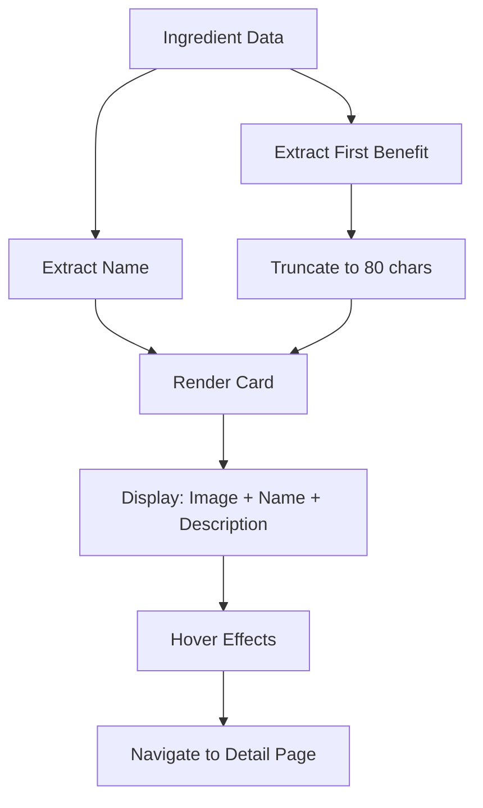

# Version 1.4.4.3 - Ingredient Card Component Implementation

**Date**: December 22, 2025

## What We Did

### Documentation Updates
- Updated `Docs/Versions/Version 1.md` to mark sub-stage 4.4.3 as completed with ingredient card functionality.

### Files Created/Modified
- **Created**: `ui/src/components/IngredientCard.jsx` - Reusable component for displaying ingredient cards in lists.
- **Modified**: `ui/src/pages/Ingredients.jsx` - Updated to use the new IngredientCard component and removed complex inline card code.

## Detailed Explanations

### Why an Ingredient Card Component?
Imagine browsing a library catalog. Each book card shows just enough info to decide if you want to read more. Our IngredientCard works the same way - it gives a quick preview without overwhelming details, making it easy for users to scan and find ingredients they're interested in.

**Beginner Explanation:**
Think of it like a business card for ingredients. It shows the name, a small picture, and a hint about what it does. When you click it, you get the full story on a separate page.

### IngredientCard Component Features

#### Compact Horizontal Layout
The card uses a horizontal layout to fit more cards on screen:
- **Square Image**: Placeholder icon on the left (w-12 h-12)
- **Content Area**: Name and description on the right
- **Space Efficient**: Uses flexbox for clean alignment

**Beginner Explanation:**
Instead of stacking everything vertically (like a tall poster), we put the image next to the text (like a magazine cover). This lets us show more ingredients without scrolling as much.

#### Visual Elements
- **Image Placeholder**: Star icon in theme colors representing natural ingredients
- **Name**: Ingredient name in bold, primary color
- **Description**: First benefit truncated to 80 characters, or default text
- **Hover Effects**: Shadow and border color changes using theme colors
- **No Underline**: Clean link styling without distracting underlines

**Beginner Explanation:**
The image is like a logo - since we don't have real photos yet, we use a star to represent "natural" or "special". The description gives a quick hint, like "This helps with digestion" instead of listing everything.

#### Responsive Design
- **Flexible Width**: Cards adapt to container size
- **Text Truncation**: Long names and descriptions are cut off with "..."
- **Touch Friendly**: Adequate padding and spacing for mobile taps

**Beginner Explanation:**
On small phones, the cards automatically adjust their size. If an ingredient name is too long, it gets shortened so everything fits nicely.

### Theme Color Integration
All visual elements use the custom theme colors from `tailwind.config.js`:
- `primary-100`: Background for image placeholder
- `primary-600`: Icon color
- `primary-700`: Name text, hover border
- `primary-800`: Name hover color
- `text-secondary`: Description text

**Beginner Explanation:**
We use the same green colors throughout the app, like wearing a uniform. This makes everything look coordinated and professional.

### Technical Implementation Details

#### Component Structure
```jsx
function IngredientCard({ ingredient }) {
  // Extract and format description
  const shortDescription = ingredient.benefits?.[0]?.substring(0, 80) + '...' || 'Default text'

  return (
    <Link to={`/ingredients/${ingredient.id}`} className="card-styles">
      <div className="flex items-center">
        <ImagePlaceholder />
        <ContentArea />
      </div>
    </Link>
  )
}
```

#### Data Processing
```javascript
// Get first benefit or fallback
const shortDescription = ingredient.benefits && ingredient.benefits.length > 0
  ? ingredient.benefits[0].substring(0, 80) + (ingredient.benefits[0].length > 80 ? '...' : '')
  : 'Natural ingredient for health and wellness'
```

#### Styling Approach
```css
/* Horizontal layout with flexbox */
.card { display: flex; align-items: center; gap: 0.75rem; }

/* Image placeholder */
.image { width: 3rem; height: 3rem; background: theme('colors.primary.100'); }

/* Content area */
.content { flex: 1; min-width: 0; } /* Prevents overflow */
.name { font-size: 0.875rem; font-weight: 600; }
.description { font-size: 0.75rem; }
```

### Visual Diagrams



**Diagram Explanation:**
Shows how ingredient data flows through the component: we take the name and first benefit, format them, then display in a card that responds to user interaction.

## Usage Instructions

### Setup Steps
1. The IngredientCard component is already imported in Ingredients.jsx
2. Component automatically uses theme colors from tailwind.config.js
3. Requires ingredient object with `id`, `name`, and `benefits` array

### Configuration
- **Image**: Currently uses placeholder SVG icon
- **Description**: Uses first benefit from `ingredient.benefits[0]`
- **Navigation**: Links to `/ingredients/${ingredient.id}`
- **Styling**: Responsive with hover effects

### Testing
To verify the ingredient cards work:
1. **Display**: Cards show in horizontal layout with image, name, description
2. **Hover**: Shadow and border color changes on hover
3. **Click**: Navigates to ingredient detail page
4. **Responsive**: Cards adapt to different screen sizes
5. **Text Handling**: Long names/descriptions are properly truncated

## Status/Next Steps

### Current Status
✅ Ingredient Card component created with horizontal layout
✅ Image placeholder with theme-colored icon
✅ Name and truncated description display
✅ Hover effects and navigation functionality
✅ Responsive design and text truncation
✅ Integrated into Ingredients page
✅ Theme colors applied consistently
✅ No underline styling for clean appearance

### Next Batch
The next development stage is **4.4.4: Create Ingredient Detail Page Component**, which will build the full detail view that users navigate to when clicking ingredient cards.
