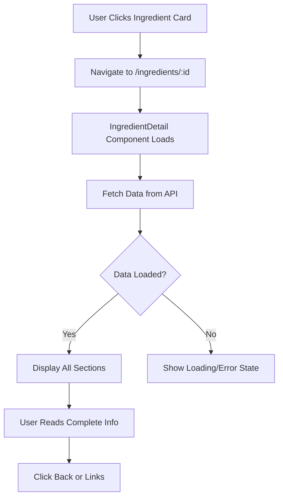

# Version 1.4.4.4 - Ingredient Detail Page Component Implementation

**Date**: December 22, 2025

## What We Did

### Documentation Updates
- Updated `Docs/Versions/Version 1.md` to mark sub-stage 4.4.4 as completed with ingredient detail page functionality.

### Files Created/Modified
- **Created**: `ui/src/pages/IngredientDetail.jsx` - Comprehensive detail page component for individual ingredients.
- **Modified**: `ui/src/pages/Home.jsx` - Updated "Explore Ingredients" button to navigate to ingredients page.

## Detailed Explanations

### Why an Ingredient Detail Page?
Imagine browsing a library. You see book covers on the shelf, but when you pick one up, you get to read the full description, reviews, and table of contents. Our IngredientDetail page works the same way - it provides complete information about a single ingredient when users click on an IngredientCard.

**Beginner Explanation:**
The ingredient cards on the list page are like previews. When you click one, you go to a special page that tells you everything about that ingredient - what it does, how to use it, any warnings, and where the information comes from.

### IngredientDetail Page Features

#### Comprehensive Information Sections
The detail page displays all available ingredient data in organized sections:
- **Header**: Ingredient name, icon, description, and tags
- **Benefits**: List of proven health benefits with icons
- **Nutrition Facts**: Nutritional information in an easy-to-read format
- **Risks & Warnings**: Safety information with clear visual indicators
- **Dosage Information**: Usage recommendations
- **Research Sources**: Credible references with clickable links

**Beginner Explanation:**
It's like a complete ingredient "profile" page. Each section answers different questions: "What does it do?" "Is it safe?" "How do I use it?" "Who says this is true?"

#### API Integration
The page fetches individual ingredient data using the backend API:
- Uses `ingredientsApi.getIngredient(id)` to get full ingredient details
- Handles loading states with spinner animation
- Shows error messages if data can't be loaded
- Displays "not found" message for invalid IDs

**Beginner Explanation:**
When you click an ingredient, the page asks the server "tell me everything about this ingredient" and then shows you the answer in a nice layout.

#### Visual Design Elements
- **Gradient Background**: Subtle page background with theme colors
- **Card Layout**: Each section in a clean white card with shadows
- **Icons**: Section headers include relevant icons for visual organization
- **Responsive Design**: Layout adapts to different screen sizes
- **Theme Consistency**: All colors and styles match the app's design system

**Beginner Explanation:**
The page looks beautiful and organized. Each section has its own box, and everything uses the same green colors as the rest of the app.

#### Interactive Elements
- **Back Button**: Arrow button to return to ingredients list
- **Clickable Links**: Research sources open in new browser tabs
- **Hover Effects**: Buttons and cards respond to mouse interaction
- **Loading States**: Shows progress while data loads

**Beginner Explanation:**
You can easily go back to the list, click on links to read more, and the page feels responsive and modern.

### Technical Implementation Details

#### Route Parameter Handling
```javascript
import { useParams } from 'react-router-dom'

const { id } = useParams()  // Gets ingredient ID from URL
```

#### API Data Fetching
```javascript
const fetchIngredient = async () => {
  try {
    const response = await ingredientsApi.getIngredient(id)
    setIngredient(response.data)
  } catch (err) {
    setError('Failed to load ingredient details.')
  }
}
```

#### Conditional Rendering
```javascript
if (loading) return <LoadingSpinner />
if (error) return <ErrorMessage />
if (!ingredient) return <NotFoundMessage />
return <IngredientDetails />
```

#### Reference Link Processing
```javascript
// Clean malformed reference strings
const cleanRef = reference.replace(/\[\(|\)\]/g, '').trim()
const url = cleanRef.match(/https?:\/\/[^\s)]+/)?.[0]

// Display as clickable link or plain text
{url ? <a href={url} target="_blank">{displayText}</a> : <span>{text}</span>}
```

### Visual Diagrams



**Diagram Explanation:**
Shows the user journey from clicking a card to viewing full ingredient details, including error handling and navigation options.

## Usage Instructions

### Setup Steps
1. The IngredientDetail page is automatically routed at `/ingredients/:id`
2. Requires backend API to be running for data fetching
3. Uses theme colors from tailwind.config.js

### Configuration
- **API Endpoint**: Uses `ingredientsApi.getIngredient(id)` 
- **Route Parameter**: Expects `id` in URL path
- **Error Handling**: Shows user-friendly messages for all error states
- **Responsive**: Adapts layout for mobile and desktop

### Testing
To verify the detail page works:
1. **Navigation**: Click any ingredient card to navigate to detail page
2. **Data Display**: Verify all sections show appropriate information
3. **Links**: Click research source links to open in new tabs
4. **Back Button**: Use back button to return to ingredients list
5. **Error States**: Test with invalid IDs or network errors
6. **Responsive**: Check layout on different screen sizes

## Status/Next Steps

### Current Status
✅ Ingredient Detail page component created with comprehensive sections
✅ API integration for fetching individual ingredient data
✅ Error handling for loading, errors, and not found states
✅ Responsive design with theme-consistent styling
✅ Interactive elements: back button, clickable reference links
✅ Visual design with gradients, icons, and clean layout
✅ Home page "Explore Ingredients" button now navigates to ingredients list

### Next Batch
The next development stage is **4.4.5: Implement Utility Components**, which will add loading spinners, error message displays, and pagination controls for a complete UI component library.
