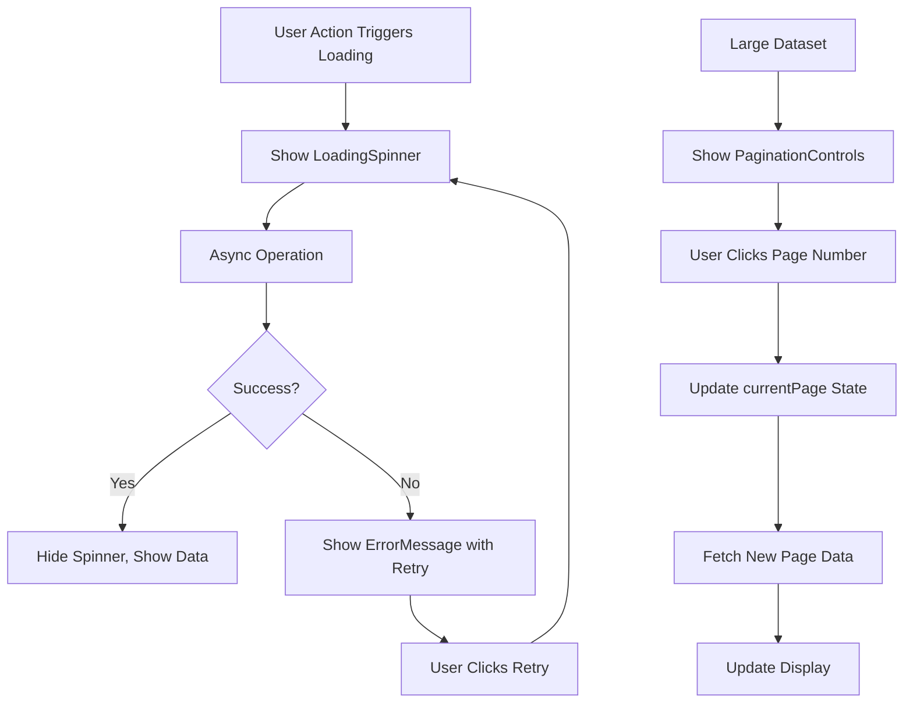

# Version 1.4.4.5 - Utility Components Implementation

**Date**: December 22, 2025

## What We Did

### Documentation Updates
- Updated `Docs/Versions/Version 1.md` to mark sub-stage 4.4.5 as completed with utility components implementation.

### Files Created/Modified
- **Created**: `ui/src/components/LoadingSpinner.jsx` - Reusable loading indicator component.
- **Created**: `ui/src/components/ErrorMessage.jsx` - Error display component with retry functionality.
- **Created**: `ui/src/components/PaginationControls.jsx` - Pagination navigation component.

## Detailed Explanations

### Why Utility Components?
Imagine building a house without reusable tools. You'd have to make a hammer for every nail! Utility components are like a well-stocked toolbox - ready-to-use pieces that handle common UI needs across your entire app. They ensure consistency, save time, and make the user experience smooth and professional.

**Beginner Explanation:**
These are like the "helper tools" of your app. Instead of writing the same loading spinner code on every page, you create one spinner component and use it everywhere. It keeps everything looking the same and working reliably.

### LoadingSpinner Component Features

#### Configurable Design
The spinner adapts to different contexts:
- **Size Options**: Small, medium, large for different use cases
- **Custom Messages**: Optional text below the spinner
- **Theme Integration**: Uses primary colors from your design system

**Beginner Explanation:**
Sometimes you need a big spinner for a whole page loading, sometimes a small one for a button. This component lets you choose the right size and add helpful messages like "Loading your ingredients...".

#### Technical Implementation
```jsx
function LoadingSpinner({ size = 'md', message = 'Loading...' }) {
  const sizeClasses = {
    sm: 'w-4 h-4',
    md: 'w-8 h-8',  // Default size
    lg: 'w-12 h-12'
  }

  return (
    <div className="flex flex-col items-center justify-center py-8">
      <div className={`${sizeClasses[size]} border-4 border-primary-200 border-t-primary-600 rounded-full animate-spin`} />
      {message && <p className="mt-4 text-text-secondary text-sm">{message}</p>}
    </div>
  )
}
```

### ErrorMessage Component Features

#### User-Friendly Error Display
The error component provides clear feedback:
- **Visual Indicators**: Warning icon and colored background
- **Clear Messages**: Easy-to-understand error descriptions
- **Recovery Options**: Optional retry button for failed operations

**Beginner Explanation:**
When something goes wrong (like the internet connection fails), users need to know what happened and what they can do about it. This component shows a nice error box with a button to try again.

#### Error Handling Flow
```javascript
// In a component that might fail
try {
  const data = await fetchData()
  // Success
} catch (error) {
  return <ErrorMessage message="Failed to load data" onRetry={fetchData} />
}
```

#### Technical Implementation
```jsx
function ErrorMessage({ message, onRetry, showRetry = true }) {
  return (
    <div className="bg-red-50 border border-red-200 rounded-lg p-6 my-4">
      <div className="flex items-start">
        <WarningIcon />
        <div className="ml-3 flex-1">
          <h3 className="text-sm font-medium text-red-800">Error</h3>
          <p className="text-sm text-red-700">{message}</p>
          {showRetry && onRetry && (
            <button onClick={onRetry} className="retry-button-styles">
              Try Again
            </button>
          )}
        </div>
      </div>
    </div>
  )
}
```

### PaginationControls Component Features

#### Smart Page Navigation
The pagination component handles complex navigation needs:
- **Page Number Display**: Shows up to 5 page numbers intelligently
- **Navigation Arrows**: Previous/Next buttons with proper disabled states
- **Current Page Highlight**: Active page clearly marked with theme colors
- **Responsive Design**: Adapts to different screen sizes

**Beginner Explanation:**
When you have lots of items (like 100 ingredients), you can't show them all at once. This component creates the "Page 1, 2, 3..." buttons that let users jump between pages of results.

#### Page Number Algorithm
```javascript
const getPageNumbers = () => {
  const pages = []
  const maxVisible = 5
  const halfVisible = Math.floor(maxVisible / 2)

  // Calculate which page numbers to show
  let startPage = Math.max(1, currentPage - halfVisible)
  let endPage = Math.min(totalPages, startPage + maxVisible - 1)

  if (endPage - startPage + 1 < maxVisible) {
    startPage = Math.max(1, endPage - maxVisible + 1)
  }

  for (let i = startPage; i <= endPage; i++) {
    pages.push(i)
  }

  return pages
}
```

### Theme Color Integration
All utility components use the custom theme colors:
- **LoadingSpinner**: `primary-200`, `primary-600` for the spinning border
- **ErrorMessage**: `red-50`, `red-200`, `red-400`, `red-700`, `red-800` for error styling
- **PaginationControls**: `primary-600`, `primary-50`, `primary-700` for active states

**Beginner Explanation:**
Just like your main app colors, these helper components use the same green theme so everything feels connected and professional.

### Technical Implementation Details

#### Component Reusability
```javascript
// Can be used anywhere in the app
import LoadingSpinner from '../components/LoadingSpinner'
import ErrorMessage from '../components/ErrorMessage'
import PaginationControls from '../components/PaginationControls'

// Examples
<LoadingSpinner size="lg" message="Loading ingredients..." />
<ErrorMessage message="Network error" onRetry={retryFunction} />
<PaginationControls
  currentPage={2}
  totalPages={10}
  onPageChange={(page) => setCurrentPage(page)}
/>
```

#### State Management Integration
```javascript
// Pagination with Redux
const { currentPage, totalPages } = useSelector(state => state.pagination)
const dispatch = useDispatch()

const handlePageChange = (page) => {
  dispatch(setCurrentPage(page))
  // Trigger data fetch for new page
  dispatch(fetchIngredients({ page, query }))
}

return (
  <PaginationControls
    currentPage={currentPage}
    totalPages={totalPages}
    onPageChange={handlePageChange}
  />
)
```

### Visual Diagrams



**Diagram Explanation:**
Shows how utility components work together: loading during async operations, error handling with retry options, and pagination for navigating large datasets.

## Usage Instructions

### Setup Steps
1. Import components where needed in your React components
2. Pass appropriate props for customization
3. Components automatically use theme colors from tailwind.config.js

### Configuration
- **LoadingSpinner**: `size` ('sm', 'md', 'lg'), `message` (string)
- **ErrorMessage**: `message` (string), `onRetry` (function), `showRetry` (boolean)
- **PaginationControls**: `currentPage` (number), `totalPages` (number), `onPageChange` (function)

### Testing
To verify utility components work:
1. **LoadingSpinner**: Import and render with different sizes
2. **ErrorMessage**: Test with different messages and retry functions
3. **PaginationControls**: Test with various page counts and current page values
4. **Theme Colors**: Verify colors match your design system
5. **Responsiveness**: Check components on different screen sizes

## Status/Next Steps

### Current Status
✅ LoadingSpinner component created with configurable sizes and theme colors
✅ ErrorMessage component created with retry functionality and error styling
✅ PaginationControls component created with smart page number display and navigation
✅ All components integrated with theme color system
✅ Components designed for reusability across the application
✅ Responsive design implemented for all screen sizes

### Next Batch
The next development stage is **4.4.6: Test Stage**, which will verify all components function correctly, integrate properly with Redux, and ensure responsiveness across devices.
